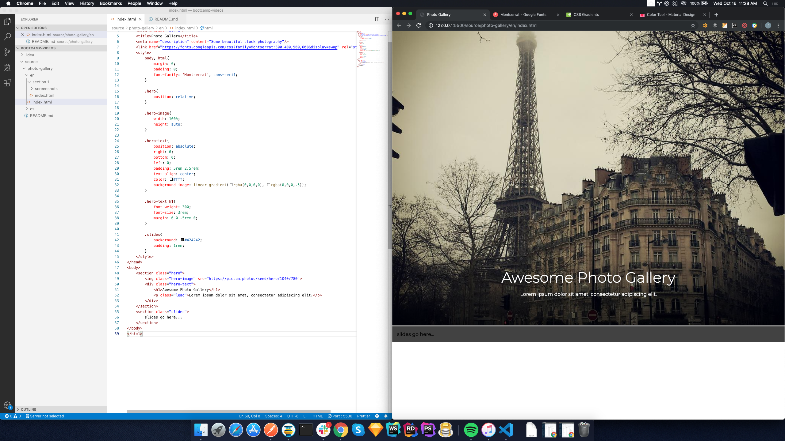
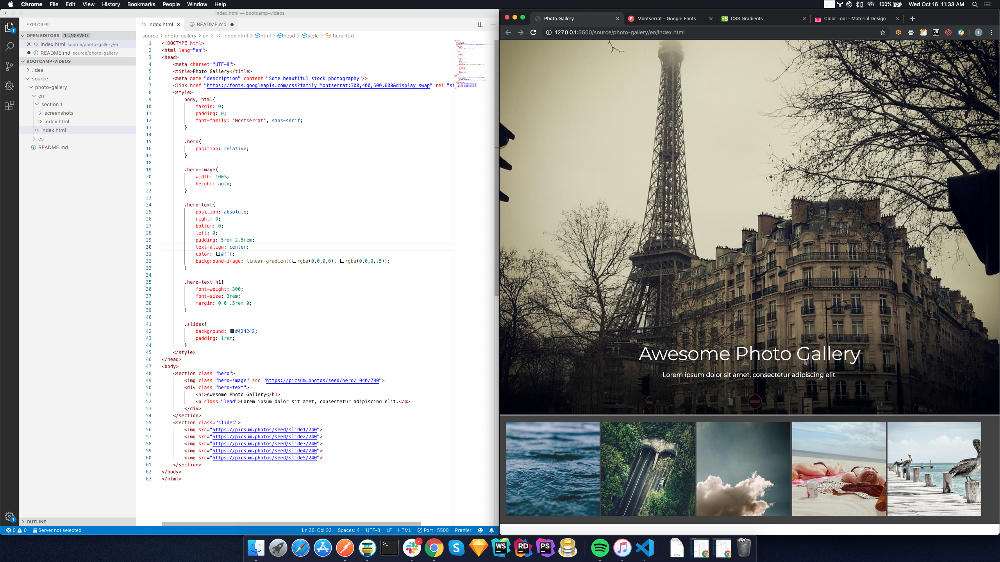
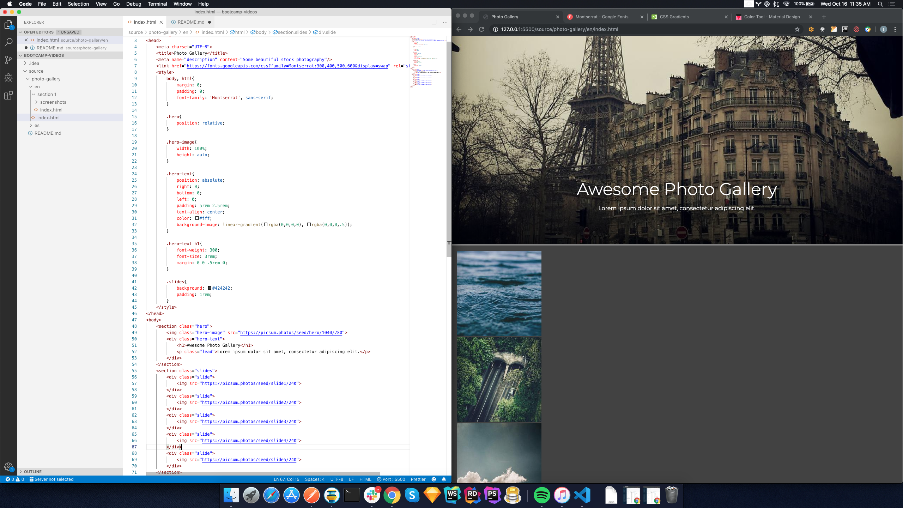
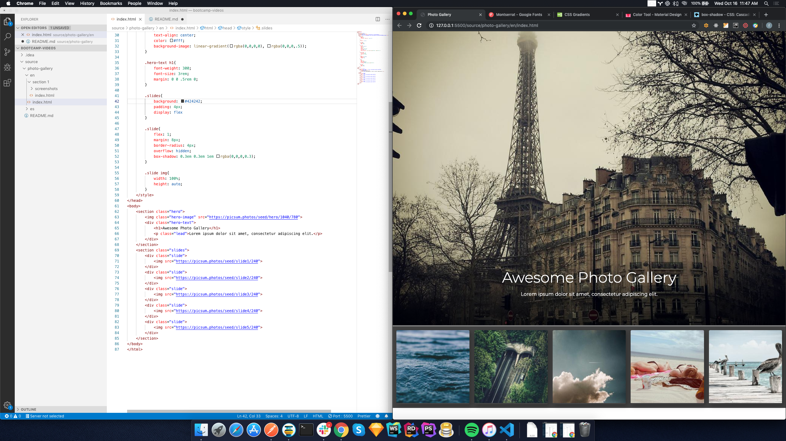
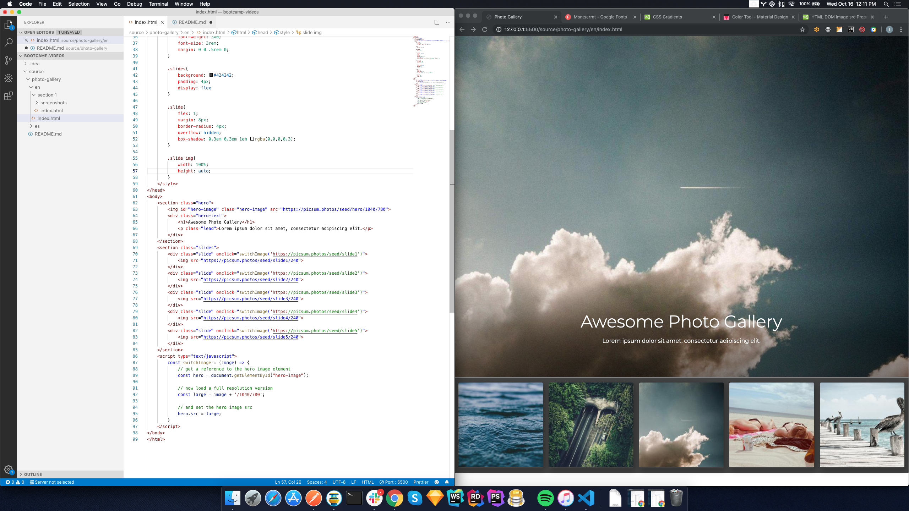
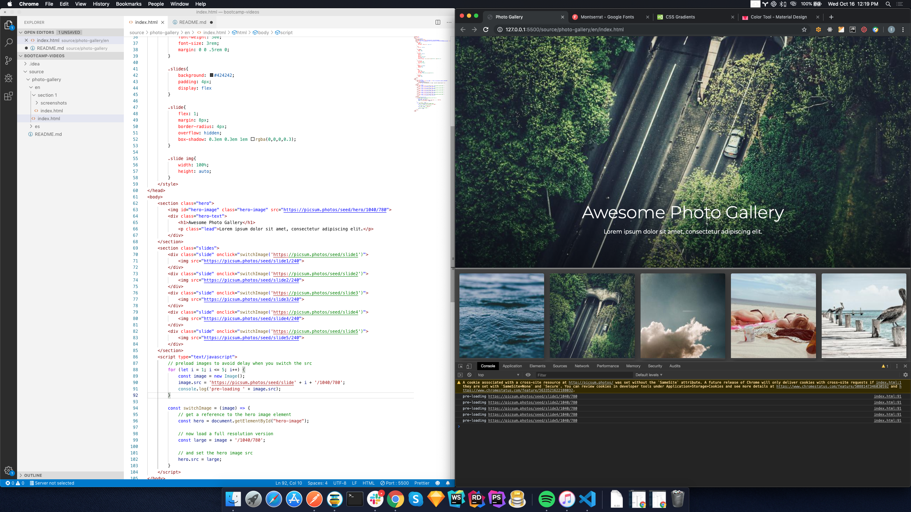

Course 1.2 Photo Gallery - Add Slides
=======================================

In this lesson we will add a list of slides beneath the hero container and add a simple JavaScript
slideshow.

## 1.2.1 Add the slide section



* add a new section for the slides
* add basic style for the section

```html
<!DOCTYPE html>
<html lang="en">
<head>
    <meta charset="UTF-8">
    <title>Photo Gallery</title>
    <meta name="description" content="Some beautiful stock photography"/>
    <link href="https://fonts.googleapis.com/css?family=Montserrat:300,400,500,600&display=swap" rel="stylesheet">
    <style>
        body, html{
            margin: 0;
            padding: 0;
            font-family: 'Montserrat', sans-serif;
        }

        .hero{
            position: relative;
        }

        .hero-image{
            width: 100%;
            height: auto;
        }

        .hero-text{
            position: absolute;
            right: 0;
            bottom: 0;
            left: 0;
            padding: 5rem 2.5rem;
            text-align: center;
            color: #fff;
            background-image: linear-gradient(rgba(0,0,0,0), rgba(0,0,0,.5));
        }

        .hero-text h1{
            font-weight: 300;
            font-size: 3rem;
            margin: 0 0 .5rem 0;
        }

        .slides{
            background: #424242;
            padding: 1rem;
        }
    </style>
</head>
<body>
    <section class="hero">
        
        <div class="hero-text">
            <h1>Awesome Photo Gallery</h1>
            <p class="lead">Lorem ipsum dolor sit amet, consectetur adipiscing elit.</p>
        </div>
    </section>
    <section class="slides">
        slides go here...
    </section>
</body>
</html>
```

## 1.2.2 Add images to the slides section



* show how to specify the size on picsum images and talk about image optimization
* add five thumbnails

```html
<!DOCTYPE html>
<html lang="en">
<head>
    <meta charset="UTF-8">
    <title>Photo Gallery</title>
    <meta name="description" content="Some beautiful stock photography"/>
    <link href="https://fonts.googleapis.com/css?family=Montserrat:300,400,500,600&display=swap" rel="stylesheet">
    <style>
        body, html{
            margin: 0;
            padding: 0;
            font-family: 'Montserrat', sans-serif;
        }

        .hero{
            position: relative;
        }

        .hero-image{
            width: 100%;
            height: auto;
        }

        .hero-text{
            position: absolute;
            right: 0;
            bottom: 0;
            left: 0;
            padding: 5rem 2.5rem;
            text-align: center;
            color: #fff;
            background-image: linear-gradient(rgba(0,0,0,0), rgba(0,0,0,.5));
        }

        .hero-text h1{
            font-weight: 300;
            font-size: 3rem;
            margin: 0 0 .5rem 0;
        }

        .slides{
            background: #424242;
            padding: 1rem;
        }
    </style>
</head>
<body>
    <section class="hero">
        
        <div class="hero-text">
            <h1>Awesome Photo Gallery</h1>
            <p class="lead">Lorem ipsum dolor sit amet, consectetur adipiscing elit.</p>
        </div>
    </section>
    <section class="slides">
        
        
        
        
        
    </section>
</body>
</html>
```

## 1.2.3 Add slide wrappers for each image



* add slide wrappers
* explain why this makes it easier to control how the are displayed

```html 
<!DOCTYPE html>
<html lang="en">
<head>
    <meta charset="UTF-8">
    <title>Photo Gallery</title>
    <meta name="description" content="Some beautiful stock photography"/>
    <link href="https://fonts.googleapis.com/css?family=Montserrat:300,400,500,600&display=swap" rel="stylesheet">
    <style>
        body, html{
            margin: 0;
            padding: 0;
            font-family: 'Montserrat', sans-serif;
        }

        .hero{
            position: relative;
        }

        .hero-image{
            width: 100%;
            height: auto;
        }

        .hero-text{
            position: absolute;
            right: 0;
            bottom: 0;
            left: 0;
            padding: 5rem 2.5rem;
            text-align: center;
            color: #fff;
            background-image: linear-gradient(rgba(0,0,0,0), rgba(0,0,0,.5));
        }

        .hero-text h1{
            font-weight: 300;
            font-size: 3rem;
            margin: 0 0 .5rem 0;
        }

        .slides{
            background: #424242;
            padding: 1rem;
        }
    </style>
</head>
<body>
    <section class="hero">
        
        <div class="hero-text">
            <h1>Awesome Photo Gallery</h1>
            <p class="lead">Lorem ipsum dolor sit amet, consectetur adipiscing elit.</p>
        </div>
    </section>
    <section class="slides">
        <div class="slide">
            
        </div>
        <div class="slide">
            
        </div>
        <div class="slide">
            
        </div>
        <div class="slide">
            
        </div>
        <div class="slide">
            
        </div>
    </section>
</body>
</html>
```

## 1.2.4 Style the slides and make them display in a flexible row



* display slides in a row with flex
* add slide style

```html
<!DOCTYPE html>
<html lang="en">
<head>
    <meta charset="UTF-8">
    <title>Photo Gallery</title>
    <meta name="description" content="Some beautiful stock photography"/>
    <link href="https://fonts.googleapis.com/css?family=Montserrat:300,400,500,600&display=swap" rel="stylesheet">
    <style>
        body, html{
            margin: 0;
            padding: 0;
            font-family: 'Montserrat', sans-serif;
        }

        .hero{
            position: relative;
        }

        .hero-image{
            width: 100%;
            height: auto;
        }

        .hero-text{
            position: absolute;
            right: 0;
            bottom: 0;
            left: 0;
            padding: 5rem 2.5rem;
            text-align: center;
            color: #fff;
            background-image: linear-gradient(rgba(0,0,0,0), rgba(0,0,0,.5));
        }

        .hero-text h1{
            font-weight: 300;
            font-size: 3rem;
            margin: 0 0 .5rem 0;
        }

        .slides{
            background: #424242;
            padding: 4px;
            display: flex
        }

        .slide{
            flex: 1;
            margin: 8px;
            border-radius: 4px;
            overflow: hidden;
            box-shadow: 0.3em 0.3em 1em rgba(0,0,0,0.3);
        }

        .slide img{
            width: 100%;
            height: auto;
        }
    </style>
</head>
<body>
    <section class="hero">
        
        <div class="hero-text">
            <h1>Awesome Photo Gallery</h1>
            <p class="lead">Lorem ipsum dolor sit amet, consectetur adipiscing elit.</p>
        </div>
    </section>
    <section class="slides">
        <div class="slide">
            
        </div>
        <div class="slide">
            
        </div>
        <div class="slide">
            
        </div>
        <div class="slide">
            
        </div>
        <div class="slide">
            
        </div>
    </section>
</body>
</html>
```

## 1.2.5 Creating the JavaScript slideshow



* add script section to page
* add js function to switch hero image source
    * talk about selecting items by id
    * add id to hero image

```html
<!DOCTYPE html>
<html lang="en">
<head>
    <meta charset="UTF-8">
    <title>Photo Gallery</title>
    <meta name="description" content="Some beautiful stock photography"/>
    <link href="https://fonts.googleapis.com/css?family=Montserrat:300,400,500,600&display=swap" rel="stylesheet">
    <style>
        body, html{
            margin: 0;
            padding: 0;
            font-family: 'Montserrat', sans-serif;
        }

        .hero{
            position: relative;
        }

        .hero-image{
            width: 100%;
            height: auto;
        }

        .hero-text{
            position: absolute;
            right: 0;
            bottom: 0;
            left: 0;
            padding: 5rem 2.5rem;
            text-align: center;
            color: #fff;
            background-image: linear-gradient(rgba(0,0,0,0), rgba(0,0,0,.5));
        }

        .hero-text h1{
            font-weight: 300;
            font-size: 3rem;
            margin: 0 0 .5rem 0;
        }

        .slides{
            background: #424242;
            padding: 4px;
            display: flex
        }

        .slide{
            flex: 1;
            margin: 8px;
            border-radius: 4px;
            overflow: hidden;
            box-shadow: 0.3em 0.3em 1em rgba(0,0,0,0.3);
        }

        .slide img{
            width: 100%;
            height: auto;
        }
    </style>
</head>
<body>
    <section class="hero">
        
        <div class="hero-text">
            <h1>Awesome Photo Gallery</h1>
            <p class="lead">Lorem ipsum dolor sit amet, consectetur adipiscing elit.</p>
        </div>
    </section>
    <section class="slides">
        <div class="slide" onclick="switchImage('https://picsum.photos/seed/slide1')">
            
        </div>
        <div class="slide" onclick="switchImage('https://picsum.photos/seed/slide2')">
            
        </div>
        <div class="slide" onclick="switchImage('https://picsum.photos/seed/slide3')">
            
        </div>
        <div class="slide" onclick="switchImage('https://picsum.photos/seed/slide4')">
            
        </div>
        <div class="slide" onclick="switchImage('https://picsum.photos/seed/slide5')">
            
        </div>
    </section>
    <script type="text/javascript">
        const switchImage = (image) => {
            // get a reference to the hero image element
            const hero = document.getElementById("hero-image");

            // now load a full resolution version  
            const large = image + '/1040/780';

            // and set the hero image src
            hero.src = large;
        }
    </script>
</body>
</html>
```

## 1.2.6 Preload images to eliminate the delay switching



* show delay loading and talk about UX
* talk about JavaScript objects
* add preload function to load the images

```html
<!DOCTYPE html>
<html lang="en">
<head>
    <meta charset="UTF-8">
    <title>Photo Gallery</title>
    <meta name="description" content="Some beautiful stock photography"/>
    <link href="https://fonts.googleapis.com/css?family=Montserrat:300,400,500,600&display=swap" rel="stylesheet">
    <style>
        body, html{
            margin: 0;
            padding: 0;
            font-family: 'Montserrat', sans-serif;
        }

        .hero{
            position: relative;
        }

        .hero-image{
            width: 100%;
            height: auto;
        }

        .hero-text{
            position: absolute;
            right: 0;
            bottom: 0;
            left: 0;
            padding: 5rem 2.5rem;
            text-align: center;
            color: #fff;
            background-image: linear-gradient(rgba(0,0,0,0), rgba(0,0,0,.5));
        }

        .hero-text h1{
            font-weight: 300;
            font-size: 3rem;
            margin: 0 0 .5rem 0;
        }

        .slides{
            background: #424242;
            padding: 4px;
            display: flex
        }

        .slide{
            flex: 1;
            margin: 8px;
            border-radius: 4px;
            overflow: hidden;
            box-shadow: 0.3em 0.3em 1em rgba(0,0,0,0.3);
        }

        .slide img{
            width: 100%;
            height: auto;
        }
    </style>
</head>
<body>
    <section class="hero">
        
        <div class="hero-text">
            <h1>Awesome Photo Gallery</h1>
            <p class="lead">Lorem ipsum dolor sit amet, consectetur adipiscing elit.</p>
        </div>
    </section>
    <section class="slides">
        <div class="slide" onclick="switchImage('https://picsum.photos/seed/slide1')">
            
        </div>
        <div class="slide" onclick="switchImage('https://picsum.photos/seed/slide2')">
            
        </div>
        <div class="slide" onclick="switchImage('https://picsum.photos/seed/slide3')">
            
        </div>
        <div class="slide" onclick="switchImage('https://picsum.photos/seed/slide4')">
            
        </div>
        <div class="slide" onclick="switchImage('https://picsum.photos/seed/slide5')">
            
        </div>
    </section>
    <script type="text/javascript">
        // preload images to avoid delay when you switch the src
        for (let i = 1; i <= 5; i++) {
            const image = new Image();
            image.src = 'https://picsum.photos/seed/slide' + i + '/1040/780';
            console.log('pre-loading ' + image.src);
        }
        
        const switchImage = (image) => {
            // get a reference to the hero image element
            const hero = document.getElementById("hero-image");

            // now load a full resolution version  
            const large = image + '/1040/780';

            // and set the hero image src
            hero.src = large;
        }
    </script>
</body>
</html>
```

