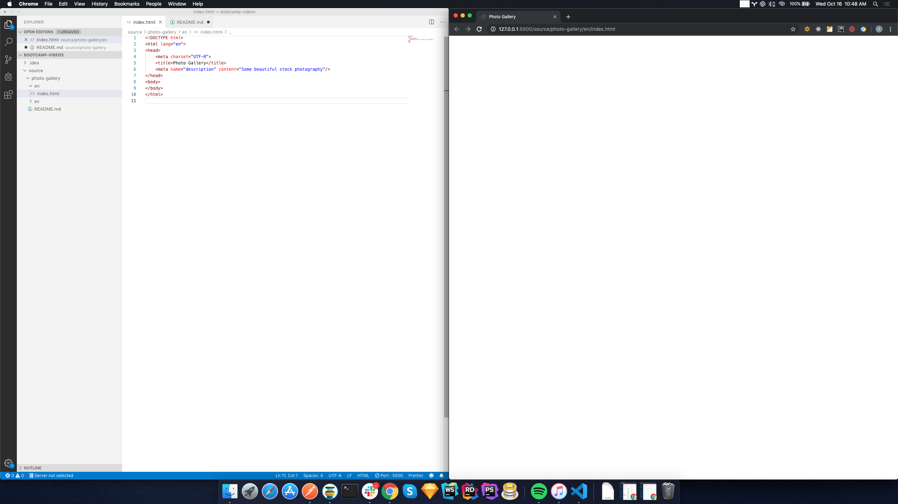
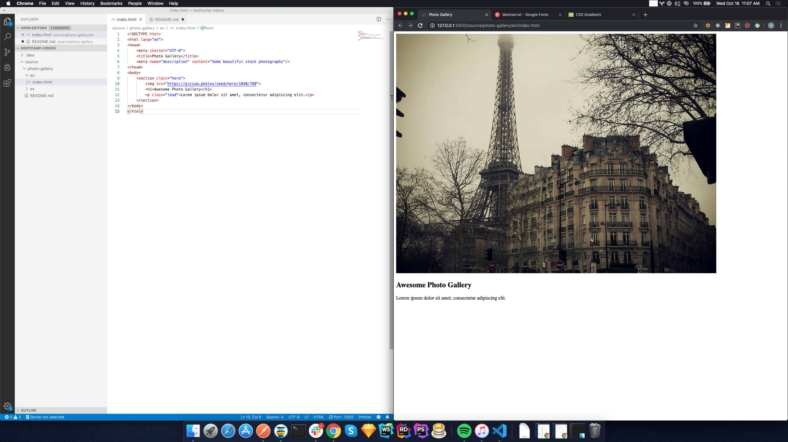
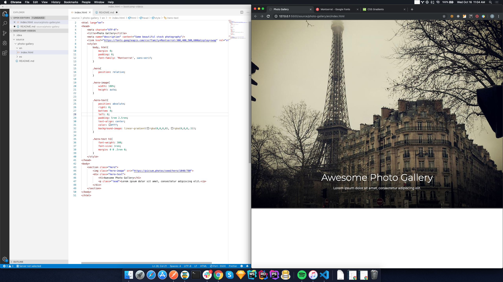
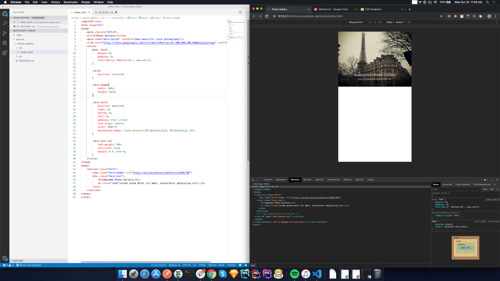

Course 1.1 Photo Gallery - Getting Started
=======================================

In this lesson we will create your first web page, add some content and make it pretty.

## 1.1.1 Getting started



* create the folder and page
* add title + meta description in head
* open the page in the browser

```html
<!DOCTYPE html>
<html lang="en">
<head>
    <meta charset="UTF-8">
    <title>Photo Gallery</title>
    <meta name="description" content="Some beautiful stock photography"/>
</head>
<body>
</body>
</html>
```

> practice: add meta keywords to the head like "photography"

## 1.1.2 Adding content to the page



* add the hero
* add the masthead photo to the hero
    * show https://picsum.photos/
* add headline
* add lead paragraph text
    * show https://www.lipsum.com/feed/html

```html
<!DOCTYPE html>
<html lang="en">
<head>
    <meta charset="UTF-8">
    <title>Photo Gallery</title>
    <meta name="description" content="Some beautiful stock photography"/>
</head>
<body>
    <section class="hero">
        
        <h1>Awesome Photo Gallery</h1>
        <p class="lead">Lorem ipsum dolor sit amet, consectetur adipiscing elit.</p>
    </section>
</body>
</html>
```

> practice: make the hero image black and white

## 1.1.3 Style the hero



* set size (max 80) of hero container
* stretch the image to fill the container
* add font from google fonts
    * show https://fonts.google.com/specimen/Montserrat
    * show how to select different font weights
* center the text
* position the text over the bottom center of the image
* style the text
* add a background gradient to give it elevation and help it display on different photographs
    * show https://www.w3schools.com/css/css3_gradients.asp

```html
<!DOCTYPE html>
<html lang="en">
<head>
    <meta charset="UTF-8">
    <title>Photo Gallery</title>
    <meta name="description" content="Some beautiful stock photography"/>
    <link href="https://fonts.googleapis.com/css?family=Montserrat:300,400,500,600&display=swap" rel="stylesheet">
    <style>
        body, html{
            margin: 0;
            padding: 0;
            font-family: 'Montserrat', sans-serif;
        }

        .hero{
            position: relative;
        }

        .hero-image{
            width: 100%;
            height: auto;
        }

        .hero-text{
            position: absolute;
            right: 0;
            bottom: 0;
            left: 0;
            padding: 5rem 2.5rem;
            text-align: center;
            color: #fff;
            background-image: linear-gradient(rgba(0,0,0,0), rgba(0,0,0,.5));
        }

        .hero-text h1{
            font-weight: 300;
            font-size: 3rem;
            margin: 0 0 .5rem 0;
        }
    </style>
</head>
<body>
    <section class="hero">
        
        <div class="hero-text">
            <h1>Awesome Photo Gallery</h1>
            <p class="lead">Lorem ipsum dolor sit amet, consectetur adipiscing elit.</p>
        </div>
    </section>
</body>
</html>
```
    
> practice: choose different fonts for the headlines and body content on google fonts

## 1.1.4 Review page



* inspect page in chrome inspector
* view on mobile / tablet in inspector

[Next Page](/1.photo-gallery/en/section 2/lesson.md)
